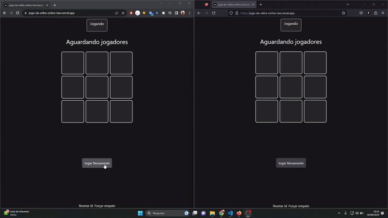

# jogo_da_velha_online

### Projeto de jogo da velha que permite duas pessoas jogarem juntas o jogo da velha em diferentes aparelhos

### Nesse projeto foi utilizado Next para mudança de páginas e os APIs do backend, e React para os components e seus Hooks, juntamente com Tailwind para estilizar os componentes.
### Foi utilizado também o banco de dados NoSQL Cloud Firestore do Firebase no qual ficam armazenadas todas as configurações necessárias ao jogo. Axios para realizar as requisições nessárias no Firestore. E por fim, o Dotenv para as variáveis de ambiente referente ao Firestore.

### Esse projeto foi hospedado na Vercel, no link: https://jogo-da-velha-online-two.vercel.app/

